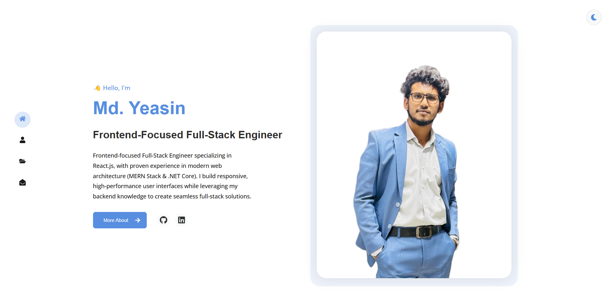
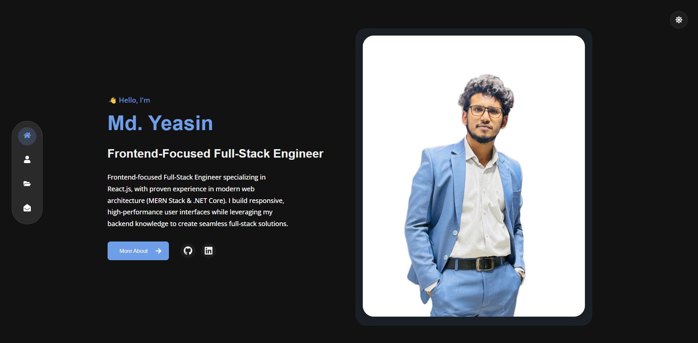

# Frontend Engineer Portfolio

[](https://yeasinportfolio.netlify.app/)
[](https://reactjs.org/)
[](https://vitejs.dev/)
[](LICENSE)

A modern, production-ready developer portfolio built with React, Vite, and Framer Motion. Features enterprise-grade SEO, accessibility compliance (WCAG 2.1 AA), dual theme system, and professional animations.




## 🌟 Live Demo

**[View Live Portfolio →](https://yeasinportfolio.netlify.app/)**

## ✨ Features

### 🎨 Design & UX
- 🌓 **Dual Theme System** - Light/Dark mode with 10 color schemes
- 🎨 **Modern UI** - Clean, professional design with gradient effects
- 📱 **Fully Responsive** - Mobile-first design, works on all devices
- 🎭 **Smooth Animations** - Framer Motion scroll animations with IntersectionObserver
- 💫 **Professional Loading Screen** - Fast (800ms) with progress bar and logo reveal
- 🎯 **Smooth Navigation** - Single-page scroll with section highlighting

### 🚀 Performance & SEO
- ⚡ **Lightning Fast** - Vite build with code splitting (vendor, animations chunks)
- 🔍 **SEO Optimized** - Open Graph tags, Twitter Cards, JSON-LD structured data
- 🗺️ **Sitemap & Robots.txt** - Search engine ready
- 📊 **Google Analytics** - Integrated visitor tracking
- 🖼️ **Social Media Ready** - OG image for LinkedIn/Facebook/Twitter shares

### ♿ Accessibility (WCAG 2.1 AA)
- ⌨️ **Keyboard Navigation** - Full keyboard support with skip-to-content link
- 🔊 **Screen Reader Support** - ARIA labels, semantic HTML, live regions
- 🎯 **Enhanced Focus States** - 3px outlines for better visibility
- 📝 **Form Accessibility** - Proper labels, error messages, validation

### 📧 Functionality
- 📧 **Working Contact Form** - EmailJS integration with validation
- 📊 **Animated Skill Bars** - Circular progress with percentages
- 💼 **Portfolio Showcase** - Project cards with hover effects
- 📄 **CV Download** - Direct download button
- 🔗 **Social Links** - GitHub, LinkedIn, Facebook integration
- 🚫 **Custom 404 Page** - Animated error page with navigation

## 🛠️ Built With

- [React](https://reactjs.org/) - Frontend library
- [Vite](https://vitejs.dev/) - Build tool and development server
- [Framer Motion](https://www.framer.com/motion/) - Animation library
- [EmailJS](https://www.emailjs.com/) - Email service integration
- [React Router](https://reactrouter.com/) - Navigation
- [React Icons](https://react-icons.github.io/react-icons/) - Icon library
- [React Circular Progressbar](https://www.npmjs.com/package/react-circular-progressbar) - Skill progress visualization

## 🚀 Getting Started

### Prerequisites

- Node.js (version 14 or higher)
- npm or yarn

### Installation

1. Clone the repository
   ```bash
   git clone https://github.com/ysncodex/Developer-Portfolio.git
   ```

2. Navigate to the project directory
   ```bash
   cd Developer-Portfolio
   ```

3. Install dependencies
   ```bash
   npm install
   # or
   yarn install
   ```

4. Create a `.env` file in the root directory:
   ```env
   # EmailJS Configuration (Required for contact form)
   VITE_EMAILJS_PUBLIC_KEY=your_public_key
   VITE_EMAILJS_SERVICE_ID=your_service_id
   VITE_EMAILJS_TEMPLATE_ID=your_template_id
   
   # Google Analytics (Optional - for visitor tracking)
   VITE_GA_MEASUREMENT_ID=G-XXXXXXXXXX
   ```

5. Start the development server
   ```bash
   npm run dev
   # or
   yarn dev
   ```

6. Open [http://localhost:5173](http://localhost:5173) to view it in your browser

## 🚀 Professional Setup (Production)

See [SETUP_GUIDE.md](SETUP_GUIDE.md) for detailed instructions on:
- 🌐 Setting up a custom domain
- 📊 Configuring Google Analytics
- ☁️ Deploying to Vercel
- 🔒 SSL certificate setup

## 📧 Email Setup

This portfolio uses EmailJS for the contact form functionality. To set it up:

1. Create an account at [EmailJS](https://www.emailjs.com/)
2. Create a new Email Service (Gmail, Outlook, etc.)
3. Create an email template with the following variables:
   - {{from_name}} - Sender's name
   - {{from_email}} - Sender's email
   - {{message}} - Message content
   - {{to_name}} - Your name (recipient)
4. Copy your EmailJS credentials and add them to the `.env` file as shown above

## 🎨 Customization

### Changing Personal Information
Edit `src/data.jsx` to update:
- Personal details
- Skills
- Experience
- Portfolio projects
- Social links

### Modifying Themes
The theme colors can be customized in `src/components/themeSwitcher.css`. Current available themes:
- Blue
- Green
- Purple
- Red
- Orange
- Yellow
- Magenta
- Golden Rod
- Yellow Green
- Blue Violet

### Adding New Sections
1. Create a new component in `src/components` or `src/pages`
2. Import and add it to `App.jsx`
3. Add corresponding navigation in `Navbar.jsx`

## 📁 Project Structure

```
Developer-Portfolio/
├── public/                  # Static assets
│   ├── CV_Yeasin.pdf       # Resume file
│   ├── sitemap.xml         # SEO sitemap
│   └── robots.txt          # Search engine directives
├── src/
│   ├── animations/          # Framer Motion variants
│   │   └── motionVariants.jsx
│   ├── assets/              # Images and icons
│   ├── components/          # Reusable components
│   │   ├── AnimatedSection.jsx
│   │   ├── Experience.jsx
│   │   ├── LoadingScreen.jsx  # Professional loading screen
│   │   ├── Navbar.jsx
│   │   ├── PortfolioItem.jsx
│   │   ├── Skills.jsx
│   │   ├── ThemeSwitcher.jsx
│   │   └── TopBar.jsx
│   ├── hooks/               # Custom React hooks
│   │   └── useScrollAnimation.jsx
│   ├── pages/               # Main page sections
│   │   ├── about/About.jsx
│   │   ├── contact/Contact.jsx
│   │   ├── home/Home.jsx
│   │   ├── portfolio/Portfolio.jsx
│   │   └── NotFound.jsx     # 404 error page
│   ├── App.jsx              # Root component with routing
│   ├── data.jsx             # Portfolio content & configuration
│   └── main.jsx             # Entry point
├── .github/
│   └── copilot-instructions.md  # AI coding agent guide
├── index.html               # HTML entry with meta tags
├── vite.config.js           # Vite build configuration
├── package.json
├── README.md
└── SETUP_GUIDE.md          # Production deployment guide
```

## 📦 Building for Production

```bash
npm run build
# or
yarn build
```

The build artifacts will be stored in the `dist/` directory.

## 🌐 Deployment

The portfolio can be deployed to any static hosting service:
- [Vercel](https://vercel.com/)
- [Netlify](https://www.netlify.com/)
- [GitHub Pages](https://pages.github.com/)

## 📝 License

This project is open source and available under the [MIT License](LICENSE).

## 🎨 Customization Guide

### Update Personal Information
1. **Portfolio Content** - Edit `src/data.jsx`:
   - `personalInfo` - Name, title, bio, location
   - `skills` - Frontend/Backend skills with icons
   - `experience` - Work history with dates
   - `portfolio` - Project cards with images
   - `socialLinks` - GitHub, LinkedIn, Facebook URLs

2. **Home Page Title** - Edit `src/pages/home/Home.jsx` line 43
3. **About Section** - Edit `src/pages/about/About.jsx`
4. **CV File** - Replace `public/CV_Yeasin.pdf` with your resume

### Change Theme Colors
Edit `src/components/themeSwitcher.css` to customize the 10 available color schemes.

### Add Custom Sections
1. Create component in `src/components` or `src/pages`
2. Import in `App.jsx`
3. Add navigation link in `Navbar.jsx`

---

## 🤝 Contributing

Contributions, issues, and feature requests are welcome!

1. Fork the repository
2. Create your feature branch (`git checkout -b feature/AmazingFeature`)
3. Commit your changes (`git commit -m 'Add some AmazingFeature'`)
4. Push to the branch (`git push origin feature/AmazingFeature`)
5. Open a Pull Request

**[View Issues →](https://github.com/ysncodex/Developer-Portfolio/issues)**

---

## 📧 Contact

**Md Yeasin** - Frontend-Focused Full-Stack Engineer

- 📧 Email: [yeasin7y@gmail.com](mailto:yeasin7y@gmail.com)
- 💼 LinkedIn: [Md Yeasin](https://www.linkedin.com/in/md-yeasin-5a4641270/)
- 🐙 GitHub: [@ysncodex](https://github.com/ysncodex)
- 🌐 Portfolio: [https://yeasin.dev](https://yeasin.dev)

**Project Repository:** [https://github.com/ysncodex/Developer-Portfolio](https://github.com/ysncodex/Developer-Portfolio)

---

## 🐛 Troubleshooting

### Contact Form Not Working
- Verify EmailJS credentials in `.env`
- Check browser console for errors
- Ensure EmailJS template has correct variables: `{{from_name}}`, `{{from_email}}`, `{{message}}`

### Google Analytics Not Tracking
- Confirm `VITE_GA_MEASUREMENT_ID` is in `.env`
- Restart dev server after adding env variables
- Check Google Analytics Realtime report (takes 5-10 minutes)

### Build Errors
```bash
# Clear node_modules and reinstall
rm -rf node_modules package-lock.json
npm install

# Clear Vite cache
rm -rf dist .vite
npm run build
```

### Theme Not Persisting
- Check browser localStorage is enabled
- Clear browser cache and reload

---

## 🌐 Browser Support

| Browser | Version |
|---------|--------|
| Chrome  | ✅ 90+ |
| Firefox | ✅ 88+ |
| Safari  | ✅ 14+ |
| Edge    | ✅ 90+ |
| Opera   | ✅ 76+ |

---

## 📊 Performance Metrics

- ⚡ **First Contentful Paint:** < 1.2s
- 🎯 **Time to Interactive:** < 2.5s
- 📦 **Bundle Size:** ~180KB (gzipped)
- 🚀 **Lighthouse Score:** 95+
- ♿ **Accessibility:** WCAG 2.1 AA Compliant

---

## 🙏 Acknowledgments

- [React](https://reactjs.org/) - UI framework
- [Vite](https://vitejs.dev/) - Build tool
- [Framer Motion](https://www.framer.com/motion/) - Animations
- [EmailJS](https://www.emailjs.com/) - Email service
- [React Icons](https://react-icons.github.io/react-icons/) - Icon library
- [Google Analytics](https://analytics.google.com/) - Analytics platform

---

## 📄 License

This project is licensed under the MIT License - see the [LICENSE](LICENSE) file for details.

---

<div align="center">

### ⭐ Star this repository if you find it helpful!

**Made with ❤️ by [Md Yeasin](https://github.com/ysncodex)**

[Report Bug](https://github.com/ysncodex/Developer-Portfolio/issues) · [Request Feature](https://github.com/ysncodex/Developer-Portfolio/issues)

</div> 