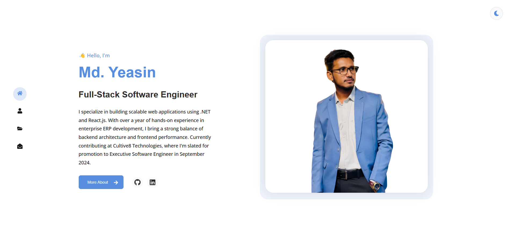

# Modern Developer Portfolio

A modern, responsive, and customizable developer portfolio built with React, Vite, and Framer Motion. Features a beautiful UI with theme switching capabilities, smooth animations, and a contact form integration.



## ✨ Features

- 🎨 Multiple theme colors with an interactive theme switcher
- 🌓 Light/Dark mode support
- 📱 Fully responsive design
- 🎯 Smooth scroll animations
- 📧 Working contact form with EmailJS integration
- 🎭 Beautiful animations using Framer Motion
- 📊 Animated skill progress bars
- 🚀 Fast loading with Vite
- 📝 Easy to customize and extend

## 🛠️ Built With

- [React](https://reactjs.org/) - Frontend library
- [Vite](https://vitejs.dev/) - Build tool and development server
- [Framer Motion](https://www.framer.com/motion/) - Animation library
- [EmailJS](https://www.emailjs.com/) - Email service integration
- [React Router](https://reactrouter.com/) - Navigation
- [React Icons](https://react-icons.github.io/react-icons/) - Icon library
- [React Circular Progressbar](https://www.npmjs.com/package/react-circular-progressbar) - Skill progress visualization

## 🚀 Getting Started

### Prerequisites

- Node.js (version 14 or higher)
- npm or yarn

### Installation

1. Clone the repository
   ```bash
   git clone https://github.com/yourusername/developer-portfolio.git
   ```

2. Navigate to the project directory
   ```bash
   cd developer-portfolio
   ```

3. Install dependencies
   ```bash
   npm install
   # or
   yarn install
   ```

4. Create a `.env` file in the root directory and add your EmailJS credentials:
   ```env
   VITE_EMAILJS_PUBLIC_KEY=your_public_key
   VITE_EMAILJS_SERVICE_ID=your_service_id
   VITE_EMAILJS_TEMPLATE_ID=your_template_id
   ```

5. Start the development server
   ```bash
   npm run dev
   # or
   yarn dev
   ```

6. Open [http://localhost:5173](http://localhost:5173) to view it in your browser

## 📧 Email Setup

This portfolio uses EmailJS for the contact form functionality. To set it up:

1. Create an account at [EmailJS](https://www.emailjs.com/)
2. Create a new Email Service (Gmail, Outlook, etc.)
3. Create an email template with the following variables:
   - {{from_name}} - Sender's name
   - {{from_email}} - Sender's email
   - {{message}} - Message content
   - {{to_name}} - Your name (recipient)
4. Copy your EmailJS credentials and add them to the `.env` file as shown above

## 🎨 Customization

### Changing Personal Information
Edit `src/data.jsx` to update:
- Personal details
- Skills
- Experience
- Portfolio projects
- Social links

### Modifying Themes
The theme colors can be customized in `src/components/themeSwitcher.css`. Current available themes:
- Blue
- Green
- Purple
- Red
- Orange
- Yellow
- Magenta
- Golden Rod
- Yellow Green
- Blue Violet

### Adding New Sections
1. Create a new component in `src/components` or `src/pages`
2. Import and add it to `App.jsx`
3. Add corresponding navigation in `Navbar.jsx`

## 📁 Project Structure

```
src/
├── animations/     # Framer Motion animation variants
├── assets/        # Images and static files
├── components/    # Reusable components
├── hooks/         # Custom React hooks
├── pages/         # Main page components
└── data.jsx       # Portfolio content and configuration
```

## 📦 Building for Production

```bash
npm run build
# or
yarn build
```

The build artifacts will be stored in the `dist/` directory.

## 🌐 Deployment

The portfolio can be deployed to any static hosting service:
- [Vercel](https://vercel.com/)
- [Netlify](https://www.netlify.com/)
- [GitHub Pages](https://pages.github.com/)

## 📝 License

This project is open source and available under the [MIT License](LICENSE).

## 🤝 Contributing

Contributions, issues, and feature requests are welcome! Feel free to check [issues page](https://github.com/yourusername/developer-portfolio/issues).

## 📧 Contact

Your Name - [yeasin7y@gmail.com](mailto:yeasin7y@gmail.com)

Project Link: [https://github.com/yourusername/developer-portfolio](https://github.com/yourusername/developer-portfolio)

---

⭐️ If you like this portfolio template, please give it a star! 